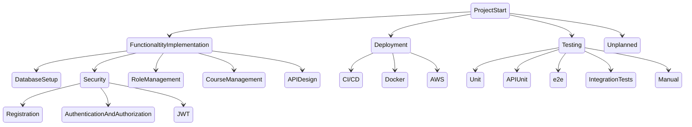

# CourseManagementSystem
Promotion project

Work breakdown structure:


# Setup Guide

To set up an EC2 instance, follow these steps to install Docker and Docker Compose:

1. Install Docker:

```bash
sudo yum install docker
sudo usermod -a -G docker ec2-user
id ec2-user
newgrp docker
```

2. Install Docker Compose:

```bash
sudo yum install python3-pip
wget https://github.com/docker/compose/releases/latest/download/docker-compose-$(uname -s)-$(uname -m)
sudo mv docker-compose-$(uname -s)-$(uname -m) /usr/local/bin/docker-compose
sudo chmod -v +x /usr/local/bin/docker-compose
```

3. Enable Docker service at AMI boot time:

```bash
sudo systemctl enable docker.service
sudo systemctl start docker.service
```

4. Create a Docker Compose file:

```bash
vi docker-compose.yml
```

Add the following content to `docker-compose.yml`:

```yaml
version: '1.0'

services:
  postgres:
    image: 'postgres:latest'
    environment:
      - 'POSTGRES_DB=management-system'
      - 'POSTGRES_PASSWORD=admin'
      - 'POSTGRES_USER=romansulymka'
    ports:
      - '5432:5432'

  app:
    image: romansulymka/course-management-system:v1
    pull_policy: always
    environment:
      - POSTGRES_HOST=postgres
      - POSTGRES_DB=management-system
      - JWT_SECRET_KEY=7134743777397A24432646294A404E635266556A586E3272357538782F412544
    ports:
      - '80:8080'
    depends_on:
      - postgres
```

5. Verify changes in `docker-compose.yml`:

```bash
cat docker-compose.yml
```

6. Start Docker Compose and pull the latest image of the Course Management System:

```bash
docker-compose up
```

7. To verify that services running use this command

```bash
docker ps
```

8. To access the API use this domain: 
```
ec2-52-91-61-185.compute-1.amazonaws.com
```

9. To authenticate in the system open this link:
```
ec2-52-91-61-185.compute-1.amazonaws.com/api/v1/auth/authenticate
```
Authentication credentials:

    - Admin:
        - Email: "admin@gmail.com"
        - Password: "adminPAss"

    - Instructor:
        - Email: "instructor@gmail.com"
        - Password: "instructorPass"

    - Student:
        - Email: "student@gmail.com"
        - Password: "studentPass"

10. Table of accessibility:

    | Request                                  | Request Type | Admin      | Instructor     | Student       |
    | ---------------------------------------- |--------------| ---------- | --------------- | ------------- |
    | /api/v1/auth/**                         | POST         | Permit All | Permit All      | Permit All    |
    | /api/v1/course/create                    | POST         | Access     | No Access       | No Access     |
    | /api/v1/course/edit                      | POST         | Access     | No Access       | No Access     |
    | /api/v1/find-all-lessons/{id}            | GET          | Access     | No Access       | No Access     |
    | /api/v1/course/{id}                      | GET          | Access     | Access          | Access        |
    | /api/v1/course/find-all                  | GET          | Access     | Access          | Access        |
    | /api/v1/course                           | PUT          | Access     | No Access       | No Access     |
    | /api/v1/course/finish                    | POST         | Access     | No Access       | No Access     |
    | /api/v1/course/user/{userId}             | GET          | Access     | Access          | Access        |
    | /api/v1/course/instructor/users          | POST         | Access     | Access          | No Access     |
    | /api/v1/course/{id}                      | DELETE       | Access     | No Access       | No Access     |
    | /api/v1/feedback                         | POST         | Access     | Access          | No Access     |
    | /api/v1/feedback/{id}                    | GET          | Access     | Access          | Access        |
    | /api/v1/feedback                         | GET          | Access     | No Access       | No Access     |
    | /api/v1/feedback/{id}                    | DELETE       | Access     | Access          | No Access     |
    | /api/v1/enrollment/instructor            | GET          | Access     | No Access       | No Access     |
    | /api/v1/enrollment/{id}                  | GET          | Access     | No Access       | No Access     |
    | /api/v1/enrollment/by-name               | GET          | Access     | No Access       | No Access     |
    | /api/v1/enrollment                       | PUT          | Access     | No Access       | No Access     |
    | /api/v1/enrollment/user/apply            | POST         | Access     | Access          | Access        |
    | /api/v1/enrollment/{id}                  | DELETE       | Access     | No Access       | No Access     |
    | /api/v1/enrollment/user/{id}             | GET          | Access     | Access          | Access        |
    | /api/v1/files/upload                     | POST         | Access     | No Access       | Access        |
    | /api/v1/files/download/{fileId}          | GET          | Access     | Access          | Access        |
    | /api/v1/files/{fileId}                   | DELETE       | Access     | Access          | Access        |
    | /api/v1/homework/mark                    | PUT          | Access     | Access          | No Access     |
    | /api/v1/homework/user/{userId}           | GET          | Access     | Access          | No Access     |
    | /api/v1/homework/{homeworkId}           | DELETE       | Access     | No Access       | No Access     |
    | /api/v1/homework/{homeworkId}           | GET          | Access     | Access          | Access        |
    | /api/v1/homework                         | POST         | Access     | Access          | Access        |
    | /api/v1/homework                         | GET          | Access     | Access          | Access        |
    | /api/v1/lesson/find-all                  | GET          | Access     | Access          | Access        |
    | /api/v1/lesson/create                    | POST         | Access     | No Access       | No Access     |
    | /api/v1/lesson/{id}                      | DELETE       | Access     | No Access       | No Access     |
    | /api/v1/lesson/edit                      | PUT          | Access     | No Access       | No Access     |
    | /api/v1/lesson/{id}                      | GET          | Access     | Access          | Access        |
    | /api/v1/lesson/find-all/{id}             | GET          | Access     | Access          | Access        |
    | /api/v1/user/create                      | POST         | Access     | No Access       | No Access     |
    | /api/v1/user/update                      | PUT          | Access     | Access          | Access        |
    | /api/v1/user/assign-role                 | POST         | Access     | No Access       | No Access     |
    | /api/v1/user/reset-password              | PUT          | Access     | Access          | Access        |
    | /api/v1/user/{id}                        | GET          | Access     | Access          | Access        |
    | /api/v1/user/email                       | POST         | Access     | Access          | Access        |
    | /api/v1/user/find-all                    | GET          | Access     | Access          | Access        |
    | /api/v1/user/{id}                        | DELETE       | Access     | No Access       | No Access     |

-----------

