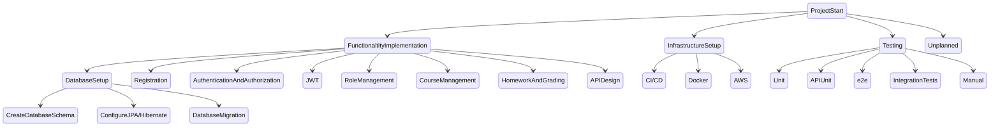

# CourseManagementSystem
Promotion project

Work breakdown structure:

```mermaid
stateDiagram
    ProjectStart --> FunctionaltityImplementation
    FunctionaltityImplementation --> DatabaseSetup
        DatabaseSetup --> CreateDatabaseSchema
        DatabaseSetup --> ConfigureJPA/Hibernate
        DatabaseSetup --> DatabaseMigration
    FunctionaltityImplementation --> Registration
    FunctionaltityImplementation --> AuthenticationAndAuthorization
    FunctionaltityImplementation --> JWT
    FunctionaltityImplementation --> RoleManagement
    FunctionaltityImplementation --> CourseManagement
    FunctionaltityImplementation --> HomeworkAndGrading
    FunctionaltityImplementation --> APIDesign
    ProjectStart --> InfrastructureSetup
        InfrastructureSetup --> CI/CD
        InfrastructureSetup --> Docker
        InfrastructureSetup --> AWS
    ProjectStart --> Testing
        Testing --> Unit
        Testing --> APIUnit
        Testing --> e2e
        Testing --> IntegrationTests
        Testing --> Manual
    ProjectStart --> Unplanned
    
```